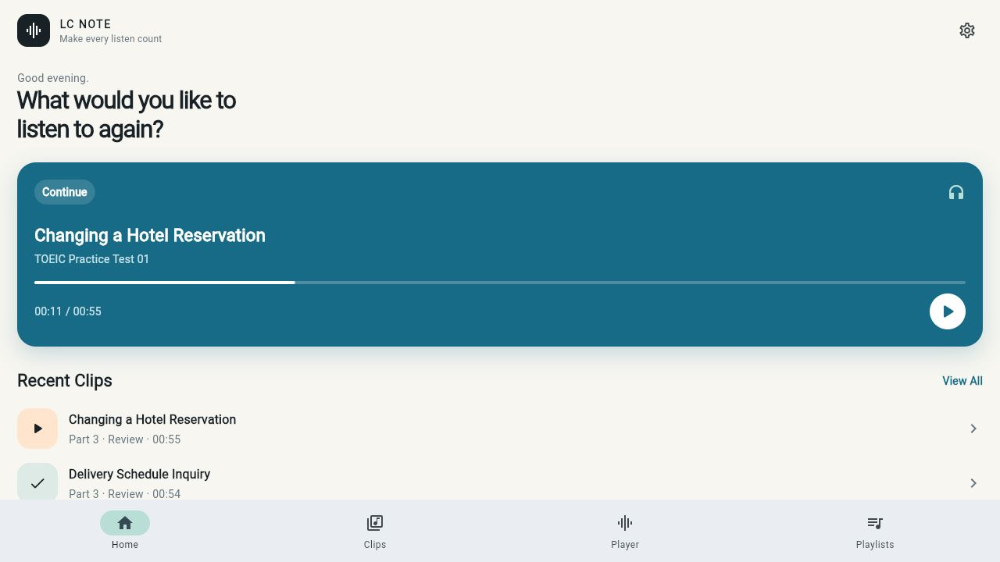
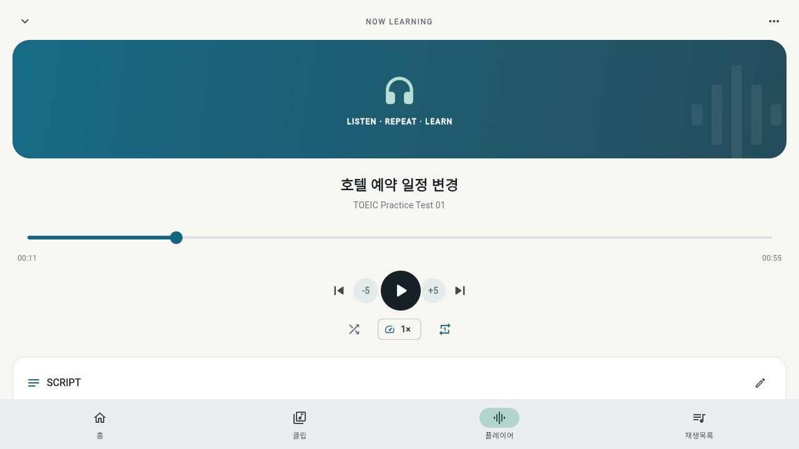
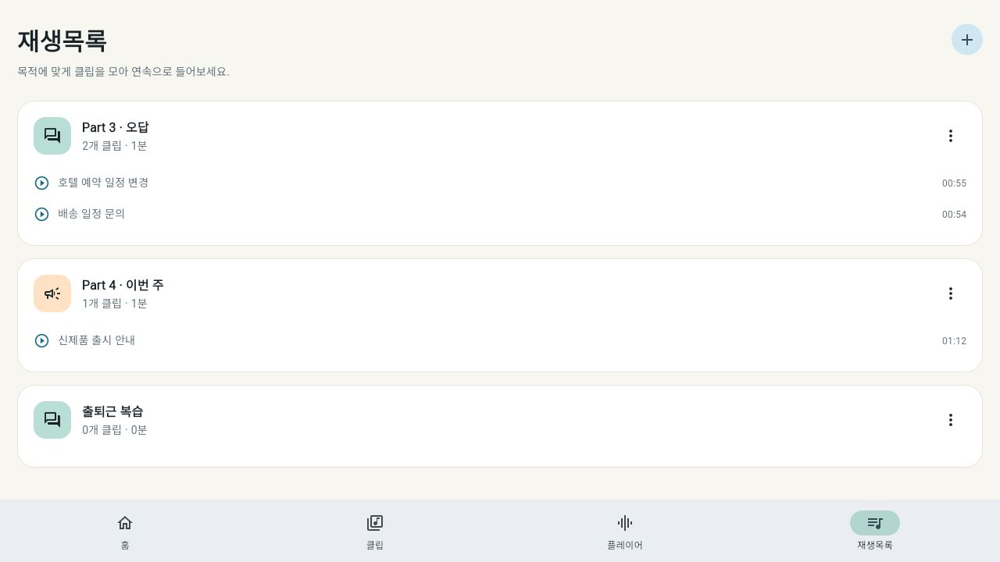

# LC Note

LC Note is a focused listening practice app built with Flutter. Import an audio file, isolate the exact section you want to study, add a transcript and notes, and replay the clip until it becomes familiar.

The interface automatically follows the device language: Korean devices keep the Korean experience, while every other system language uses English.

## Screenshots

### Home



### Focused player



### Playlists



> Screenshots show the English interface. Devices using Korean as their system language display the corresponding Korean interface automatically.

## Features

- Import local audio in MP3, M4A, WAV, AAC, OGG, or FLAC format
- Create precise listening clips by entering timestamps or exploring the audio timeline
- Detect long silences and generate suggested listening segments automatically
- Customize silence sensitivity, minimum silence duration, minimum segment length, and boundary padding
- Preview each detected segment before applying it to the clip editor
- Scrub and resume playback anywhere inside the selected start–end range
- Fine-tune timestamps manually or with the detailed timeline controls
- Replay, shuffle, skip, and change playback speed
- Attach a full transcript and personal study notes to each clip
- Organize clips into editable playlists
- Mark clips as complete and keep recent practice close at hand
- Continue playback through Android media controls
- Save clips, playlists, and playback preferences locally
- Automatically switch between Korean and English based on the system language

## Built With

- [Flutter](https://flutter.dev/) and Material 3
- [`just_audio`](https://pub.dev/packages/just_audio) for playback and precise audio ranges
- [`audio_service`](https://pub.dev/packages/audio_service) for Android media controls
- [`audio_decoder`](https://pub.dev/packages/audio_decoder) for waveform analysis and silence-based segmentation
- [`file_picker`](https://pub.dev/packages/file_picker) for local audio selection
- [`shared_preferences`](https://pub.dev/packages/shared_preferences) for local persistence

## Getting Started

### Requirements

- Flutter SDK compatible with Dart `^3.12.2`
- A configured Flutter target such as Android, iOS, Windows, macOS, or Linux

### Run locally

```bash
git clone <your-repository-url>
cd LC_Note
flutter pub get
flutter run
```

Choose a specific target when needed:

```bash
flutter devices
flutter run -d <device-id>
```

## Quality Checks

```bash
flutter analyze
flutter test
```

The widget test suite covers the Korean and English interfaces, responsive player controls, playlist creation, clip management, silence-based segmentation, short-segment merging, timeline editing, seeking, and saving clips without a transcript.

## Data and Privacy

LC Note stores study data locally on the device. Imported audio remains in its original local location; the app saves the file reference and your clip metadata, transcript, notes, playlists, playback settings, and silence-detection preferences. Temporary low-resolution analysis files are removed immediately after segmentation.

## Project Status

LC Note is an actively developed personal listening-study project. Feedback and contributions are welcome through GitHub issues and pull requests.
